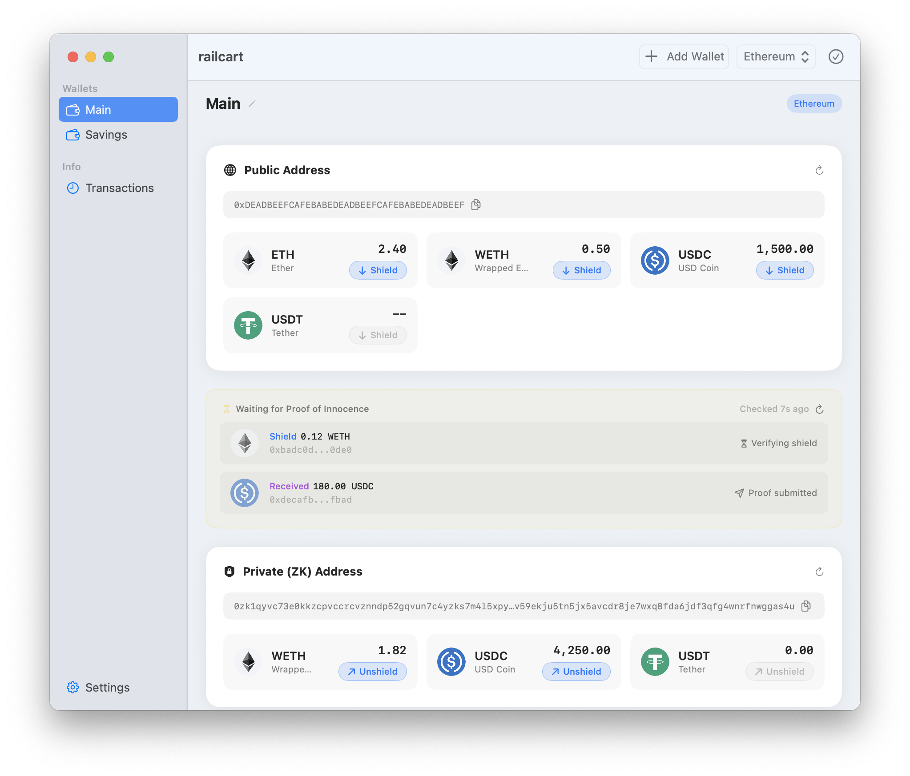

# railcart: privacy should be easy

railcart is a macOS app for using the RAILGUN protocol, allowing users to safely and privately transact on Ethereum.

> you must tell gatekeeper to allow railcart to run using `xattr -dr com.apple.quarantine /Applications/railcart.app` after you drag it to Applications.

railcart will *not* be submitted through the app store for review as it would likely not be approved, or potentially be removed in the future. See the privacy considerations below.

### installation

Download the latest release and drag to your applications folder. **You must manually approve railcart before running** or you'll see a "This application cannot be..." message from macOS. This is Apple's gatekeeper software preventing you from running software you want on hardware that you own. Open terminal (use the shortcut in the DMG) and paste or type the following command *after* you copy railcart to your applications folder:

> `xattr -dr com.apple.quarantine /Applications/railcart.app`

This removes the "quarantine" attribute from the app which tells gatekeeper that you are allowing it to run. It does not impact the security of anything else on your mac and you only have to do this once.

### about RAILGUN

### privacy

There is zero telemetry in railcart. The app connects to ipfs via `railcart.eth.limo` to check for updates. Updates are hosted on ipfs and have no server-side backend that could be used to collect data.

Railgun uses graphql endpoints for zk merktle tree scanning which railcart uses for fast balance updates. railcart also communicates with RPC providers to fetch balances or send transactions, and you can override this with a paid or local RPC provider if needed. Public RPC endpoints can be unreliable, railcart will warn you if it cannot fetch via public RPC.

### security

Your mnemonic and private keys are stored locally in a encrypted LevelDB instance run by the code in the public railgun SDK (same as that powering other railgun wallets) and the encryption keys are stored in the user keychain, protected by your own macOS security policy (user password or biometrics, FileVault if you have it turned on, etc). Wallet access is protected by a password set on first run and TouchID if available.

We use the `hardened-runtime` entitlement to ensure that the application cannot be manipulated by other software on your machine and sign the app with a certificate bearing the public key fingerprint `6d43338e3f820c458da84332cf2d374ed13295be0f86fc7f338ddd6b8f970295`.

Your password, wallet and any other user data never leaves your own device.

Depdencies are vendored into the project to prevent agressive updating by package managers and provide visibility on exactly what code is changing in a commit. We utilize [dependency cooldowns](https://blog.yossarian.net/2025/11/21/We-should-all-be-using-dependency-cooldowns) to update packages to limit the risk of supply chain attacks.